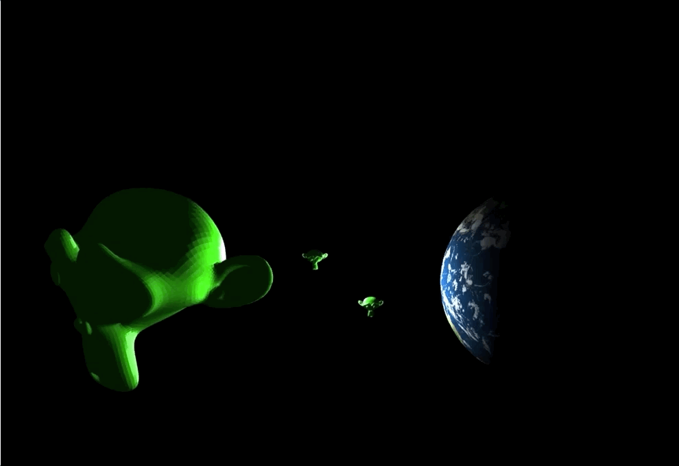

# Computer Graphics - Phong Lighting

In this lab, you will implement the Phong Lighting Model.

Your goal is to complete the two fragment shaders [frag.rgb.glsl](./lab/shaders/frag.rgb.glsl) and [frag.uv.glsl](./lab/shaders/frag.uv.glsl); you must use the uniform and varying data passed provided to calculate the displayed fragment color. You may find the [Phong lighting cheatsheet](./cheatsheet.pdf) helpful; it provides a summary of the lighting model that we will discuss in class.

When your shaders have been completed successfully, you should see two small lights circling two models:

